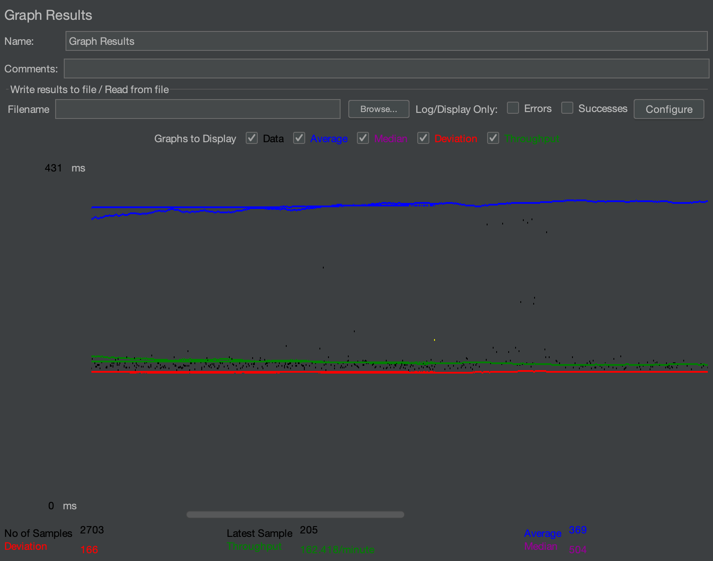
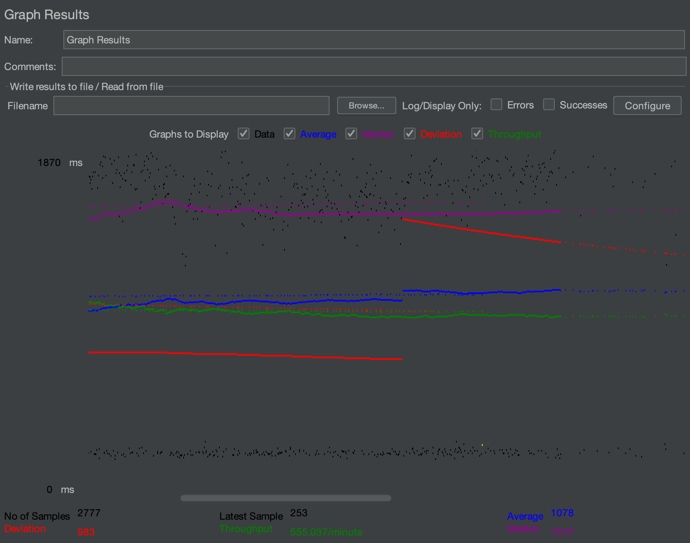
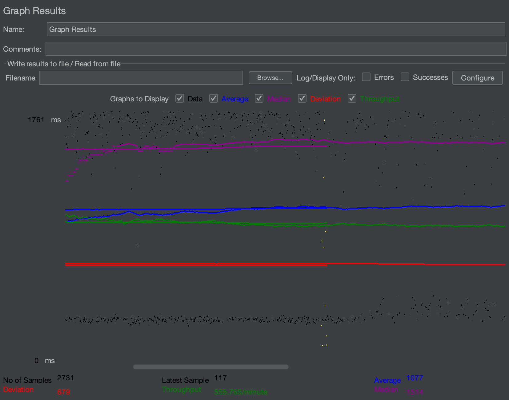
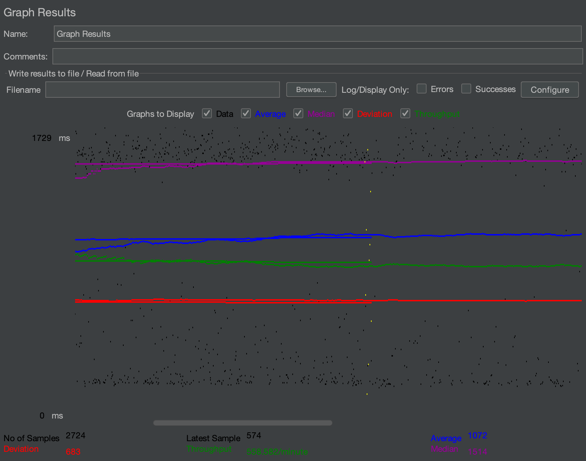
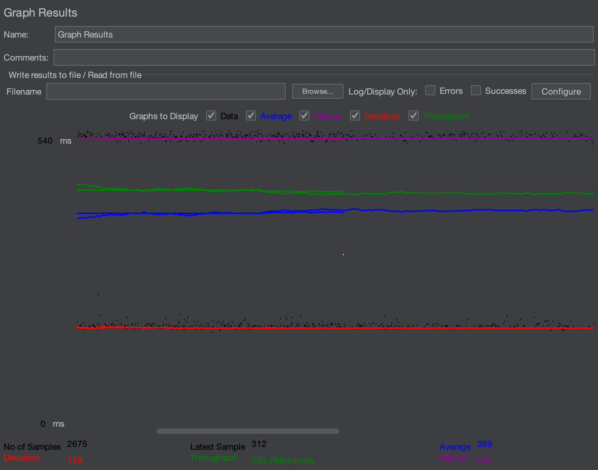
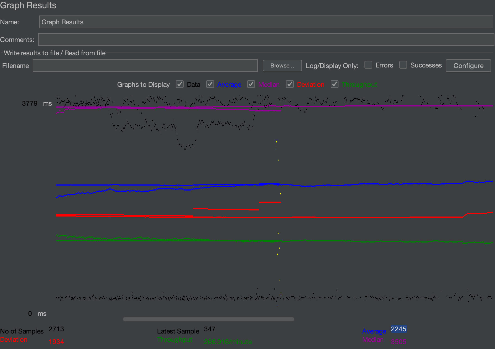
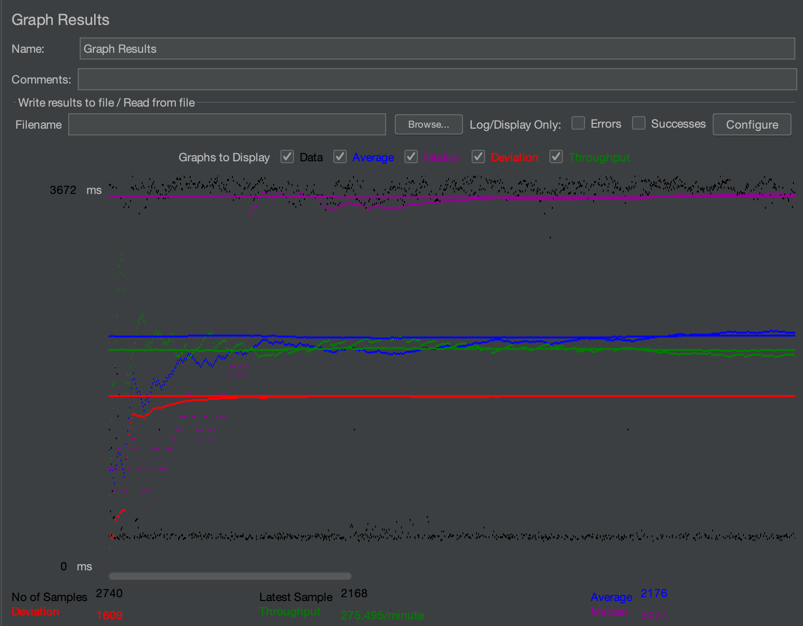

# Group Name: Brogle
## Group Members: Kian Ranjbar and Brian Avalos Herrera

# All Project URLs:
Web Application URL: https://3.145.141.199:8443/2023-fall-cs122b-brogle/
Load Balancer: http://3.145.141.199:80/2023-fall-cs122b-brogle/
Primary Instance: http://18.188.27.136:8080/2023-fall-cs122b-brogle/
Secondary Instance: http://3.134.89.147:8080/2023-fall-cs122b-brogle/

Project 1 Youtube Video URL: https://youtu.be/XX0qBLJgecQ
or try this: https://www.youtube.com/watch?v=XX0qBLJgecQ

Project 2 Youtube Video URL: https://youtu.be/yeYJorNbZno
or try this: https://www.youtube.com/watch?v=yeYJorNbZno

Project 3 Youtube Video URL: https://youtu.be/Jr4YU6b8aI8
or try this: https://www.youtube.com/watch?v=Jr4YU6b8aI8

Project 4 Youtube Video URL: https://youtu.be/DLWP_nQIlr4
or try this: https://www.youtube.com/watch?v=DLWP_nQIlr4

Project 5 Youtube Video URL: https://youtu.be/M8DEa5sgq28
or try this: https://www.youtube.com/watch?v=M8DEa5sgq28

# Project 1 Contributions:
* Movie List Page (BackEnd and FrontEnd): Kian
* Single Star Page (BackEnd and FrontEnd): Kian
* Single Movie Page (BackEnd and FrontEnd) : Brian
* CSS: Both

# Project 2 Contributions:
* Task 1 (Implement the login page): Kian
* Task 2 (Implement the main page with search and browse): Kian
* Task 3 (extend project 1) : Both
* Task 4 (implement the shopping cart): Brian
  
# Project 3 Contributions:
* Task 1 (Adding reCAPTCHA): Kian
* Task 2 (Adding HTTPS): Both
* Task 3 (Use Prepared Statement): Both 
* Task 4 (Use Encrypted Password): Kian 
* Task 5 (Implementing a Dashboard using Stored Procedure): Kian
* Task 6 (Importing large XML data files into the Fabflix database): Both

# Project 4 Contributions:
* Task 1 (Improving the Fabflix by Full-text Search and Autocomplete): Both
* Task 2 (Developing an Android App for Fabflix): Both

# Project 5 Contributions:
* Task 1 (JDBC Connection Pooling): Both
* Task 2 (MySQL Master-Slave Replication): Both
* Task 3 (Scaling Fabflix with a cluster of MySQL/Tomcat and a load balancer): Both
* Task 4 (Measuring the performance of Fabflix search feature): Kian

# How LIKE was used:
* All conditions had to be converted to lowercase because ILIKE isn't supported by MySQL
  * For **SEARCHING**, substring matching was used with LIKE (%_%)
  * To get the Prefixes of only Alphanumeric characters in the backend, used REGEXP operator along with SUBSTRING
    * For **BROWSING**, prefix matching was used
      * For the letters and numbers, used LIKE (_%)
      * For the starts with "*" browse option (movies that start with non-alphanumeric characters), "NOT REGEXP" operator is used with regex expression of alphanumeric characters

# Filenames with Prepared Statements:
* AdminLoginServlet.java
* LoginServlet.java
* PaymentServlet.java
* ResultsServlet.java
* SingleMovieServlet.java
* SingleStarServlet.java

# Optimization Strategies:
* One of the optimization strategies that was implemented involved generating IDs for movies and stars while minimizing
the amount of calls to MySQL. We did this by pulling the biggest ID in the table with one call to MySQL at the beginning 
and then generated new IDs within the file instead of calling to the database each time. This can be seen within each of
parser files: SAXActorParser, SAXCastsParser, SAXMoviesParser. 
* The second optimization we implemented was using threads to insert all the data that was parsed into the database. 
This can be seen within the Threads.java file. We did this with a thread pool size of 6.
* Overall, before these optimizations our local running time for parsing the data was at an average time of about
690000 milliseconds (11.5 minutes). There was a significant reduction in time as after the optimizations the average was
around 260000 milliseconds (4.3 minutes).

# Inconsistent Data:
* Number of Stars Inserted: 6855
* Number of Duplicate Stars: 8
* Number of Movies with inconsistencies: 932
* Number of Movies added: 12077
* Number of Genres added: 12
* Number of added links of Genres with Movies: 8940
* Number of added links of Star with Movie: 46563
* Number of Movies not Found: 216
* Number of duplicate/already existing Star with Movie: 2375
* Number of entries with unknown actors: 2020
* Number of Movies without Stars: 3018
* (Locally) Elapsed Time: 209847 milliseconds ~ 03:30 minutes
* (AWS Instance) Elapsed Time: 699984 milliseconds ~ 11:40 minutes

# Connection Pooling
* ### Include the filename/path of all code/configuration files in GitHub of using JDBC Connection Pooling.
  * WebContent/META-INF/context.xml
  * WebContent/WEB-INF/web.xml
  * src/NewSingleMovieServlet.java
  * src/SingleMovieServlet.java
  * src/NewSingleStarServlet.java
  * src/SingleStarServlet.java
  * src/ResultsServlet.java
  * src/LoginServlet.java
  * src/AdminLoginServlet.java
  * src/PaymentServlet.java
  * src/MainServlet.java
  * src/MetadataServlet.java
  * src/MovieSuggestionsServlet.java
  * src/Top20MoviesServlet.java

* ### Explain how Connection Pooling is utilized in the Fabflix code.
  * The datasource is configured as a connection pool. 
  The connection pool is configured in the context.xml file. 
  The context.xml file is then referenced in the web.xml file. 
  The connection pool is then used in the servlets to get a connection to the database instead of creating
  a brand-new connection each time. The connection is then returned to the connection pool after the servlet finishes using it.

* ### Explain how Connection Pooling works with two backend SQL.
  * Each backend SQL has its own connection pool.
  When a servlet needs a connection to the database, it gets a connection from the connection pool of the backend SQL
  the request was sent to. So although there are two connection pools, the servlets only use one of them at a time unless
  the sql query is writing to the database. In that case, the servlet will get a connection from the connection pool of
  the primary SQL and then use that connection to write to the database. The servlet will then return the connection to
  the connection pool of the primary SQL. The primary SQL will then replicate the write to the secondary SQL.

# Master/Slave
  - #### Include the filename/path of all code/configuration files in GitHub of routing queries to Master/Slave SQL.
    - WebContent/META-INF/context.xml

  - #### How read/write requests were routed to Master/Slave SQL?
    - The Apache2 webserver uses its proxy_balance to manage which backend instance to send the request to. With sticky
    sessions, the proxy_balance will send the request to the same backend instance that the user was previously on based on the session ID.
    This is what allows the servlets to correctly get information from the sessions since sessions are stored within the backend instance.
    

# JMeter TS/TJ Time Logs
  - #### Instructions of how to use the `log_processing.*` script to process the JMeter logs.
      - The log_processing.py script hardcodes the file path of the log file to be "logs/timing.txt".
        So the log file must be in the logs directory and must be named "timing.txt". The script will then
        go through the whole file and average the search servlet time and JDBC time because each line in the log file
        is formatted as "<single TS> <single TJ>". The script will then print out the average TS and TJ for
        that log file. The script can be run with the following command: `python3 log_processing.py`

# JMeter TS/TJ Time Measurement Report

| **Single-instance Version Test Plan**          | **Graph Results Screenshot** | **Average Query Time(ms)** | **Average Search Servlet Time(ms)** | **Average JDBC Time(ms)** | **Analysis**                                                                                                                                                                                                                                                                                                                                                                                              |
|------------------------------------------------|------------------------------|----------------------|-----------------------------|-------------------|-----------------------------------------------------------------------------------------------------------------------------------------------------------------------------------------------------------------------------------------------------------------------------------------------------------------------------------------------------------------------------------------------------------|
| Case 1: HTTP/1 thread                          |     | 369                  | 210.09298955255366                            | 209.64165529089564                  | With a single thread, each thread had no downtime and the aws instance could easily pick up the request and process the search servlet without any issue with MySQL since it was the only one there. However, the throughput of this single thread was much slower than the ones with 10 threads which shows that although it was faster per thread, it was slower in serving a large amount of requests. |
| Case 2: HTTP/10 threads                        |     | 1078                   | 913.582035192266                            | 913.007380617275                  | With 10 threads, times went up per thread, but throughput was much greater than just a single thread so many requests were being handled more efficiently. Thread time may have went up though since more threads were competing for the micro EC2 AWS instance which his very limited resources.                                                                                                         |
| Case 3: HTTPS/10 threads                       |     | 1077                     | 832.4795379069511                            | 831.9918484354542                  | The reason why HTTPS was slightly faster than HTTP with 10 threads may be due to fluctuations in latency with the AWS instance itself. HTTPS is very modernized to where the overhead isn't very noticeable anymore which also attributes to it being slightly faster.                                                                                                                                    |
| Case 4: HTTP/10 threads/No connection pooling  |        | 1072                     | 918.2255959259396                            | 917.6806798843036                  | The small difference in speed without using connection pooling may indiciate that in this speficic scenario, the overhead dealing with maintaining and distribution connections from this connection pool may not be performing as good as it would in a different scenario. This may be due to the resources available in the AWS EC2 instance.                                                          |

| **Scaled Version Test Plan**                   | **Graph Results Screenshot** | **Average Query Time(ms)** | **Average Search Servlet Time(ms)** | **Average JDBC Time(ms)** | **Analysis**                                                                                                                                                                                                                                                                                                                                                                                                                                                                                                                                              |
|------------------------------------------------|------------------------------|------------------------|-------------------------------|---------------------|-----------------------------------------------------------------------------------------------------------------------------------------------------------------------------------------------------------------------------------------------------------------------------------------------------------------------------------------------------------------------------------------------------------------------------------------------------------------------------------------------------------------------------------------------------------|
| Case 1: HTTP/1 thread                          |     | 389                       | 221.357512907629                              | 220.48256914435302                    | HTTP with 1 thread on the scaled instance is slightly slower than HTTP with 1 thread on the single instance because the load balancer proxy first has to deal with finding which backend server to send it to, as well as maintaining the sticky session. In addition, it is not competing for any resources which is why the single thread is fast, although the throughput is still low.                                                                                                                                                                |
| Case 2: HTTP/10 threads                        |     | 2245                       | 2077.278298                              | 2076.387401                    | When using 10 threads, the query time goes up due to the fact that now all the threads are sending requests to the load balancer which requires time and resources and if the AWS intance is not too powerful, it will get caught up in load balancing and distributing the requests. Also, the threads are competing among the resources for 1 of the 2 instances being used for scaling, along with the fact that if it went to the secondary/slave instance for a write, it now had to access the primary's/master's MySQL database in order to write. |
| Case 3: HTTP/10 threads/No connection pooling  |     | 2176                     | 2011.258045                              | 2010.496107                    | No connection pooling decreases the average query time by about 66 ms, indicating that connection pooling's drawbacks may be outweighing its benefits within this scenario which does not have resource intensive instances.                                                                                                                                                                                                                                                                                                                              |